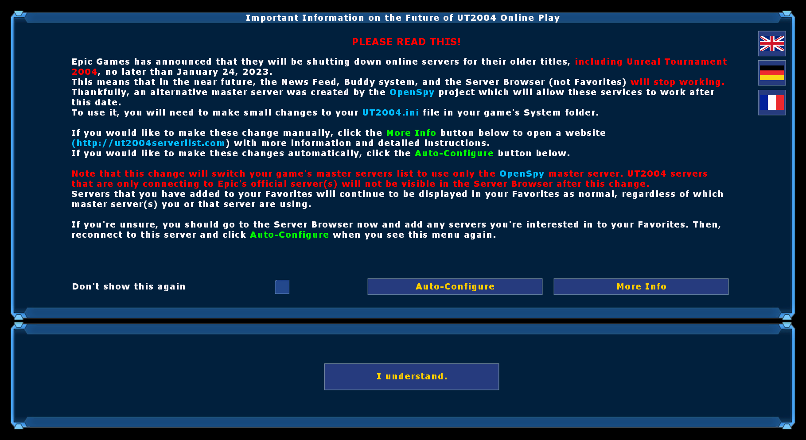

OpenSpyInfo
===========
OpenSpyInfo is a simple mutator for Unreal Tournament 2004 with the goal of informing players of the need to switch to an alternate master server in the wake of Epic Games' announcement regarding the shutdown of the official ones.
At this time, the alternate master server chosen is [OpenSpy](https://github.com/chc/openspy-core-v2).
This mutator will prompt players who join a server with a menu before spawning which informs them of the situation and what actions they need to take.
The menu will also provide players with a button they can use to automatically configure their master server list if they so choose.

This mutator is fully compatible with DruidsPlayerAgreement. When both mods are in use, the OpenSpyInfo menu will display first and then the player agreement menu will display after the OpenSpy menu is dismissed.

Installation
------------
Download the [latest release](https://github.com/0xC0ncord/OpenSpyInfo/releases/latest) and install it to your server's `System/` directory. Then, to activate the mod, do one of the following:
1. Add the server actor to your `ServerActors`:
```
ServerActors=OpenSpyInfo110.OpenSpyInfoServerActor
```
OR

2. Add the mutator to your server's commandline (placement order does not matter):
```
Mutator=OpenSpyInfo110.MutOpenSpyInfo,...
```
You must also ensure that this package exists on your server's redirect, regardless of whether you add it as a Server Actor or as a Mutator.
No matter which method you choose, your server will have the `MutOpenSpyInfo` mutator running which is needed to react to joining players and prompt them with the menu.
Adding the file to your `ServerPackages` is optional as the mutator will do this automatically.

Screenshots
-----------


License
-------
OpenSpyInfo is licensed under the Open Unreal Mod License version 1.1. See [LICENSE](LICENSE) for details.

Credits
-------
- the OpenSpy team for their amazing work on the OpenSpy UT2k3/UT2k4 master server!
- `Clinton H Goudie-Nice aka TheDruidXpawX` for his work on the DruidsPlayerAgreement mutator, from which some code is borrowed!
- `SgtMuffin` for identifying and helping to test a fix for menus reopening when other players joined!
- `Infy` for her menu design and feedback!
- `voltz`, `Aeon`, `DeepC`, and `DW>Ant` for their feedback!
- `Ema` for the German translation.
- `Cosma` for the French translation.
- `Ragnos` for identifying the incompatibility and testing with AntiTCC and help fixing encoding issues in the translations.
- Me, `0xC0ncord` aka `TonyTheSlayer` for the initial conception and creation of this mod.
